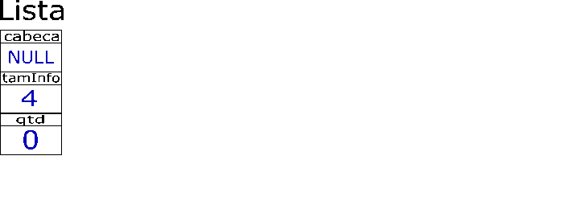

# Lista Encadeada

Uma lista encadeada é uma lista onde cada elemento possui, além da informação principal, o endereço do elemento adjacente.

Para que a lista possa comportar qualquer tamanho de dado definido pelo programa que a usará, a informação principal não está contida no elemento, mas apenas referenciada nele por meio de um ponteiro. Há apenas um ponto de inserção e de extração de elementos, a ```cabeca```, tornando o funcionamento desta estrutura semelhante àquele de uma pilha.


